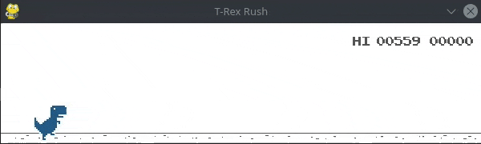

# Workshop de Algoritmos Genéticos

Material utilizado no workshop de algoritmos genéticos ministrado pelo Grupo Turing
em maio de 2019. O conteúdo desse workshop foi assunto de um de nossos
[posts no medium][1].

No workshop, construiu-se um jogador de _dino rush_ com algoritmos genéticos:



## Pré-requisitos

O workshop utiliza a linguagem Python 3 e depende das seguintes bibliotecas:

- [pygame](https://www.pygame.org/)
- [NumPy](https://numpy.org/)
- [chrome_trex](https://github.com/GrupoTuringCodes/chrome-trex-rush)

As instruções de instalação de Python podem ser encontradas [aqui](https://realpython.com/installing-python/).
Para instalar as bibliotecas, execute o seguinte comando:

```bash
pip install -r requirements.txt
```

## Guia de Uso

A pasta _material_ contém as apresentações e o código utilizados no workshop.

A [primeira apresentação](material/tutorial_python_numpy.pdf) cobre os assuntos
básicos de python e da biblioteca numpy. A [segunda](material/algoritmos_geneticos.pdf)
apresenta o conceito de algoritmos genéticos e as tarefas a serem realizadas.
Além dessas apresentações, o conteúdo do workshop também está disponível em:
[Algoritmos Genéticos - Turing Talks][1].

Em seguida, há os arquivos de código:

- [enunciado.py](material/genetico.py): contém um código base que deve ser completado.
- [gabarito.py](material/gabarito.py): contém uma possível resolução do enunciado.

Obs: o arquivo *chrome_trex.zip* mencionado na apresentação de algoritmos genéticos
corresponde ao pacote *chrome_trex* que foi instalado nos [pré-requisitos](#pré-requisitos).

## Autores

O material e o workshop foram organizados por uma equipe do [Grupo Turing](https://github.com/GrupoTuringCodes):

- [Fernando Matsumoto](https://github.com/fernandokm)
- [Luísa Heise](https://github.com/luisaheise)
- Guilherme Mota

## Licença

Distribuído sob a licença MIT. Veja `LICENSE` para mais informações.

[1]: https://medium.com/turing-talks/turing-talks-8-algoritmos-gen%C3%A9ticos-a791c25bd7ba
